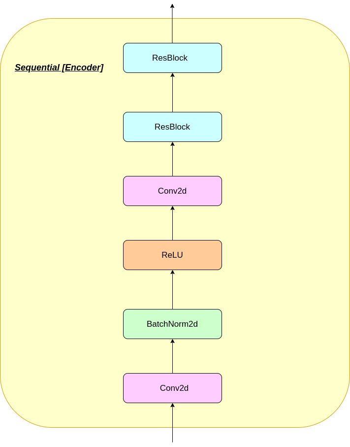
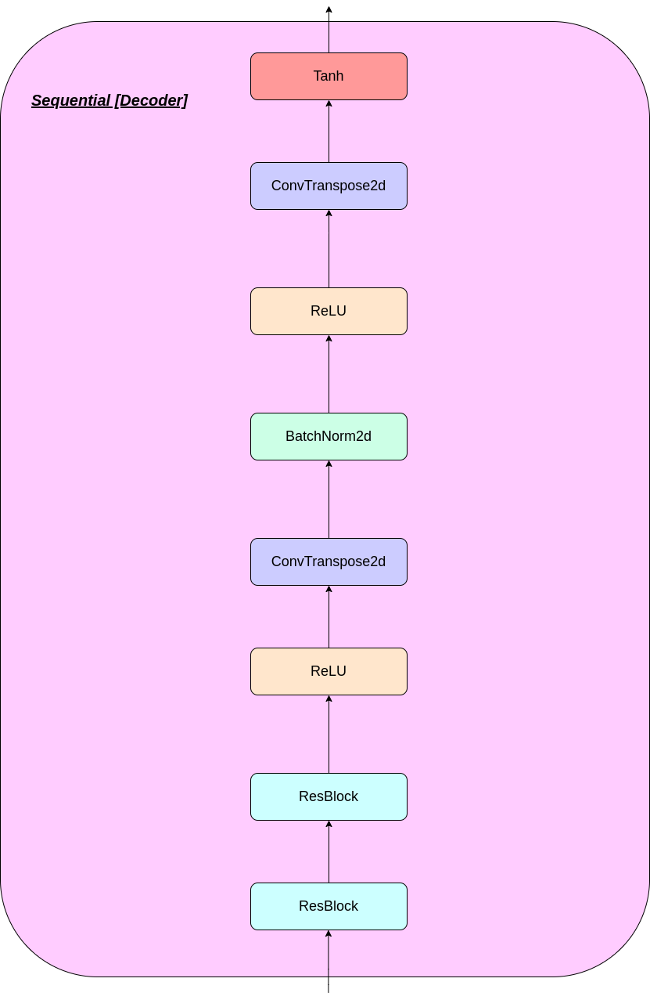
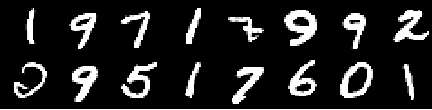
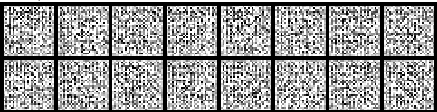
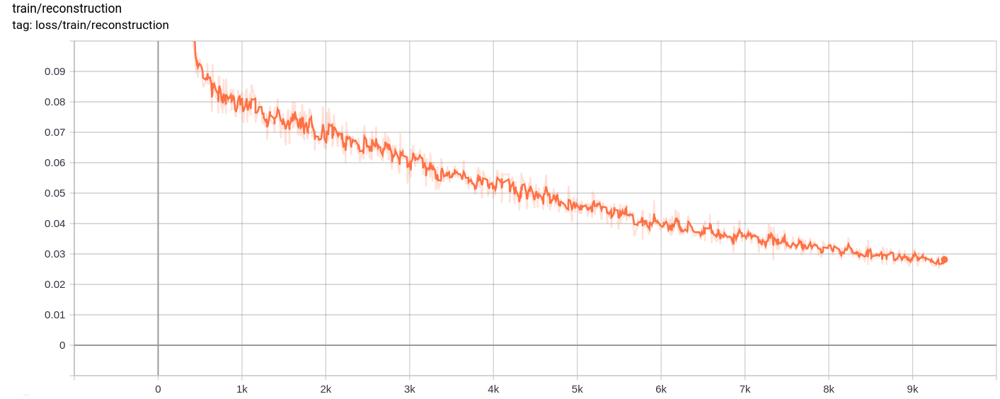
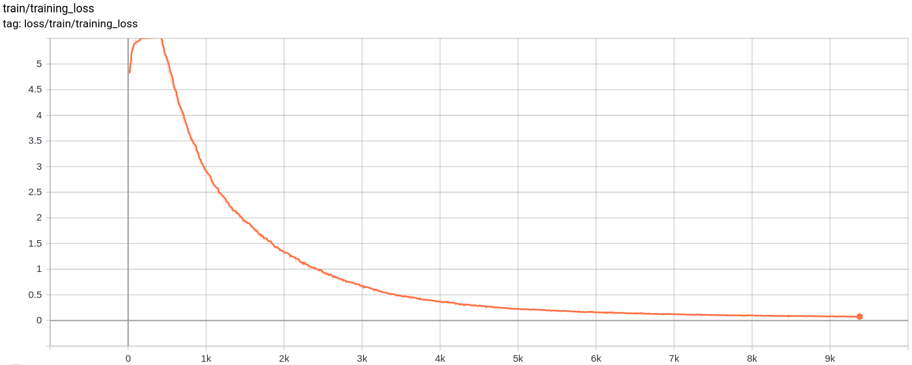
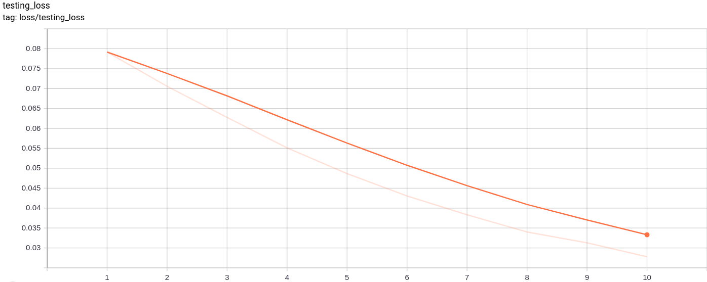

# Vector-Quantized Variational AutoEncoder(VQ-VAE)
The repository consists of a VQ-VAE implemented in PyTorch and trained on the MNIST dataset. 

## VQ-VAE: Overview

VQ-VAE follow the same basic concept as behind the variational auto-encoders(VAE). VQ-VAE use **discrete latent embeddings for variational auto encoders**,i.e. each dimension of z(latent vector) is a discrete integer, instead of the continuous normal distribution generally used while encoding the inputs. 

VAEs consist of 3 parts:

1. An encoder network that parametrizes the posterior q(z|x) over latents
2. A prior distribution p(z)
3. A decoder with distribution p(x|z) over input data

Well, you may ask about the differences VQ-VAEs bring to the table. Let's list them out:

1. Encoders model a categorical distribution, sampling from which you get integral values
2. These integral values are used to index a dictionary of embeddings
3. The indexed values are then passed on to the decoder 

## Why introduce the differences?

Many important real-world objects are discrete.  For example in images we might have categories like “Cat”, “Car”, etc. and it might not make sense to interpolate between these categories. Discrete representations are also easier to model.

## Architecture


where: 

- `n` : batch size
- `h` : image height
- `w` : image width
- `c` : number of channels in the input image
- `d` : number of channels in the hidden state

## Working

Here's a brief overview of the working of a VQ-VAE network:

1. VQ-VAE consists of an encoder, an embedding(or a codeBook) and a decoder. 
2. When an image is passed as input, it is converted into **latent vectors using the encoder network**. 



3. The embedding space consists of many latent vectors, which are compared to that of the input one. 
4. The distances are calculated and **the most similar(least distance) latent vector(in the embedding space) to the input's latent vector** is selected.
5. The selected one is fed into the **decoder network which reconstructs the image**. 

  

## Vector Quantization Layer


The working of VQ layer can be explained in six steps as numbered in the figure:

1. **Reshape:** All dimensions except the last one are combined into one so that we have n*h*w vectors each of dimensionality d
2. **Calculating distances:** For each of the n*h*w vectors we calculate distance from each of k vectors of the embedding dictionary to obtain a matrix of shape (n*h*w, k)
3. **Argmin:** For each of the n*h*w vectors we find the the index of closest of the k vectors from dictionary
4. **Index from dictionary:** Index the closest vector from the dictionary for each of n*h*w vectors
5. **Reshape:** Convert back to shape (n, h, w, d)
6. **Copying gradients:** It's not possible to train this architecture through backpropagation as the gradient won’t flow through argmin. Hence we try to approximate by copying the gradients from z_q back to z_e. In this way we’re not actually minimizing the loss function but are still able to pass some information back for training.

## Loss Functions

VQ-VAE uses 3 losses to compute the total loss during training: 

1. **Reconstruction loss:** optimizes the decoder and encoder as VAE,i.e. the difference between the input image and the reconstruction:

    `reconstruction_loss = -log( p(x|z_q) )`
    
2. **CodeBook loss:** due to the fact that gradients bypass the embedding, a dictionary learning algorithm which uses an **l2** error to move the embedding vectors e_i towards the encoder output is used.
  
    `codebook_loss = ‖ sg[z_e(x)]− e ‖^2`
  
    (sg represents stop gradient operator meaning no gradient flows through whatever it's applied on)
  
3. **Commitment loss:** since the volume of the embedding space is dimensionless, it can grow arbitrarily if the embeddings e_i do not train as fast as the encoder parameters, and thus a commitment loss is added to make sure that the encoder commits to an embedding.

    `commitment_loss = β‖ z_e(x)− sg[e] ‖^2` 
    
    (β is a hyperparameter that controls how much we want to weigh commitment loss compared to other components)

## Contents
1. [Setup Instructions](#1-setup-instructions)
2. [Training your model from scratch](#2-training-your-model-from-scratch)
3. [Generating images from model](#3-generating-images-from-model)
4. [Repository Overview](#4-repository-overview)
5. [Results](#5-results)
    1. [Training images](#1-training-images)
    2. [Training Graphs](#2-training-graphs)
    3. [Testing Graphs](#3-testing-graphs)
    4. [Generated images](#4-generated-images)
6. [Observations](#6-observations)
7. [Credits](#7-credits)

## 1. Setup Instructions
You can either download the repo or clone it by running the following in cmd prompt
```
https://github.com/praeclarumjj3/VQ-VAE-on-MNIST.git
```

## 2. Training your model from scratch

You can train the model from scratch by the following command (in google colab)
```
! python3 VQ-VAE.py --output-folder [NAME_OF_OUTPUT_FOLDER] --data-folder [PATH_TO_MNIST_dataset] --device ['cpu' or 'cuda' ] --hidden-size [SIZE] --k [NUMBER] --batch-size [BATCH_SIZE] --num_epoch [NUMBER_OF_EPOCHS] --lr [LEARNING_RATE] --beta [VALUE] --num-workers [NUMBER_OF_WORKERS]

```

- `output-folder`- name of the data folder
- `data-folder`  - name of the data folder
- `device`       - set the device (cpu or cuda, default: cpu)
- `hidden-size`  - size of the latent vectors (default: 40 )
- `k`            - number of latent vectors(default: 512)
- `batch-size`   - batch size (default: 128)
- `num-epochs`   - number of epochs (default: 10)
- `lr`           - learning rate for Adam optimizer (default: 2e-4)
- `beta`         - contribution of commitment loss, between 0.1 and 2.0 (default: 1.0)
- `num-workers`  - number of workers for trajectories sampling (default: cpu_count() - 1)

The program automatically downloads the MNIST dataset and saves it in `PATH_TO_MNIST_dataset` folder (you need to create this folder). This only happens once.

It also creates a `logs` folder and `models` folder and inside them creates a folder with the name passed by you to save logs and model checkpoints inside it respectively.

## 3. Generating images from model

To generate new images from z sampled randomly from a unit gaussian run the following command(in google colab):  

```
! python3 generate.py  --model [SAVED_MODEL_FILENAME] --input [MNIST_or_random] --device ['cpu' or 'cuda' ] --hidden-size [SIZE] --k [NUMBER] --filename [SAVING_NAME] 
```

- `model`        - filename containing the model
- `input`        - MNIST or random
- `device`       - set the device (cpu or cuda, default: cpu)
- `hidden-size`  - size of the latent vectors(default: 40 )
- `k`            - number of latent vectors (default: 512)
- `filename`     - name with which file is to be saved

It generates a 10*10 grid of images which are saved in a folder named `generatedImages`.

You can use a pre-trained model by downloading it from the link in `model.txt`.

## 4. Repository Overview

The repository contains the following files

- `modules.py` - Contains the different modules used for making our model
- `VQ-VAE.py`  - Contains the functions and code for training our VQ-VAE model 
- `vector_quantizer.py` - The vector quantization classes are defined in this file 
- `generate-py` - Generates new images from a pre-trained model
- `model.txt` - Contains a link to a pre-trained model
- `README.md` - README giving an overview of the repo
- `references.txt` - references used while creating this repo 
- `readme_images` - Has various images for the readme
- `MNIST` - Contains the zipped MNIST Dataset(though it will be downloaded automatically if needed)
- `Training track for VQ-VAE.txt` - contains the loss values during the training of our VQ-VAE model 
- `logs_VQ-VAE` - Contains the zipped tensorboard logs for our VQ-VAE model (automatically created by the program)
- `testers.py` - Contains some functions to test our defined modules

Command to run tensorboard(in google colab):

```
%load_ext tensorboard
%tensordboard --logdir [path_to_folder_with_logs]
```
## 5. Results
### 1. Training images
Training Image



Image from 0th epoch  



Image from 2nd epoch  


Image from 4th epoch  


Image from 6th epoch  


Image from 8th epoch  


Image from 10th epoch  

 
  
The reconstructions keep on improving and at the end almost resemble the training_set images which is reflected in the loss values(check in `Training track for VQ-VAE.txt`).

### 2. Training Graphs
  **Reconstruction Loss**
  
          
    
  **Quantization Loss**  
   
     
        
  **Total_Loss**
       
     

  **The total loss , reconstruction loss and quantization loss decrease uniformly as expected.**

### 3. Testing Graphs
        
  **Testing_Loss**
        
     

  **The testing loss decreases uniformly as expected.**
     

### 4. Generated images

The following image grid was generated after passing MNIST images as inputs:


The generation is pretty good.

The following image grids were generated after passing a z sampled randomly from a unit gaussian  as input to model and then passed through the decoder       

     

The images don't look perfect. Tuning the latent space's dimensions, number of embedding vectors etc. can help in generating better random images.


 ## 6. Observations
 The model was trained on google colab for 10 epochs, with batch size 128. 
 
 After training the model was able to reconstruct the input images quite well, and was also able to generate new images although the generated images are not so good.  
 The training as well as the testing loss also kept on decreasing almost monotonically.
 
 I observed that training the model for more than 10-20 epochs produced results that suggested a probable sign of overfitting in the model. Also, I experimented with different dimensions of the latednt space and in the end `dimension = 40` produced the best results. The best range for dimension came out to be between 16-42.
 
 ## 7. Credits
 The following sources helped a lot to make this repository
 
 - [Neural Discrete Representation Learning - 
Aaron van den Oord, Oriol Vinyals, Koray Kavukcuoglu](https://arxiv.org/abs/1711.00937)
 - [Generating Diverse High-Fidelity Images with VQ-VAE-2 - 
Ali Razavi, Aaron van den Oord, Oriol Vinyals](https://arxiv.org/abs/1906.00446)
 - https://nbviewer.jupyter.org/github/zalandoresearch/pytorch-vq-vae/blob/master/vq-vae.ipynb
 - https://www.kaggle.com/ameroyer/keras-vq-vae-for-image-generation
 - https://blog.usejournal.com/understanding-vector-quantized-variational-autoencoders-vq-vae-323d710a888a
 - https://christineai.blog/pixelcnn-and-pixelrnn/
 - https://github.com/ritheshkumar95/pytorch-vqvae
 - https://github.com/ayushtues/GenZoo
 
 
 


